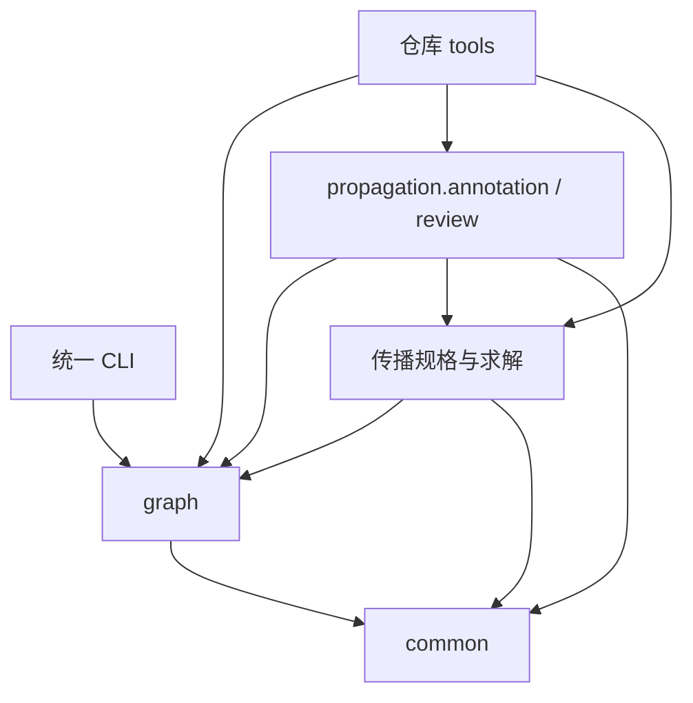

# SkillFlow 架构与迁移验收

本次将已有实现按 **graph、propagation、common** 三个职责区域组织，并将生产包、研究证明、仓库工具和实验材料分开保存。迁移改变代码组织与安装入口，既有 IR、Data、联合标注、观察编译、传播和 DOE 输入的业务契约保持原有版本。

本页为当前布局的说明。逐文件旧地址、新地址及迁移前摘要以[主迁移清单](../../experiments/migrations/layout-v1-20261002-215752/manifest.json)和[三份建图示例补充清单](../../experiments/migrations/layout-v1-20261002-215752-examples/manifest.json)为准。直接审查验收结果可打开[迁移总览](../../experiments/migrations/layout-v1-20261002-215752/index.html)。

## 一、当前架构与文件位置

```text
SkillFlow/
├─ pyproject.toml                 根生产包；发行名和命令均为 skillflow
├─ src/skillflow/
│  ├─ graph/                     建图、结构校验、受控核对和 CFG 反馈
│  │  ├─ ir/                     原 CFG、IR 操作数和结构规则
│  │  ├─ extraction/             固定提取 Prompt、候选编译与单次提取
│  │  ├─ audit/                  受控回述、事实检查和源文核对
│  │  ├─ feedback/               有界 CFG 反馈闭环
│  │  └─ experiments/            生产建图实验调度
│  ├─ propagation/               安全与传递标注、编译和确定性求解
│  │  ├─ annotation/             一次整图联合标注及观察编译
│  │  ├─ review/                 聚焦审查、最多一次修复及独立复审
│  │  ├─ contracts/              Profile、运行时、表示与 Sink 固定契约
│  │  └─ data/                   Data 类型、注册表与字段关系
│  ├─ common/                    两阶段共用的工程能力
│  │  ├─ inputs/                 Skill 包加载、冻结与文本索引
│  │  ├─ llm/                    HTTP/SSE、超时、传输重试和请求记录
│  │  └─ paths.py                项目资源与精确历史地址解析
│  └─ cli.py                     analyze / render / experiment 根入口
├─ formal/                       Lean 结构规则与完整事实保持证明
├─ tests/                        graph / propagation / common 回归
├─ tools/
│  ├─ graph/                     baseline / audit / feedback 仓库工具
│  ├─ propagation/               annotation / review 与传播实验工具
│  └─ corpus/                    语料、PDF 生成与验证工具
├─ examples/
│  ├─ graph/                     echo_skill / alert_skill / simple_skill
│  └─ propagation/               Data、处理段和可选参数离线示例
├─ experiments/
│  ├─ configs/                   建图实验配置
│  ├─ datasets/                  建图实验数据集定义
│  ├─ graph/                     baseline / audit / feedback 实验材料
│  ├─ propagation/               annotation / review 与传播实验材料
│  ├─ corpus/                    冻结语料、外置事实及来源清单
│  └─ migrations/                地址清单、验收和迁移保护记录
├─ docs/                         graph / propagation / doe / architecture
├─ dataset/skills/               原 30 个评测输入 ZIP，保持原样
└─ result/                       原 CFG、评审和既有交付物，保持原样
```

`graph` 负责建立并核对可分析的控制与数据依赖框架。`propagation` 消费选定 CFG，把标注的符号处理关系编译为可求值规格，再记录 Data 版本、数据事件、边界和 IN／OUT。`common` 只提供共享工程能力，不解释业务操作或替模型决定读取、保护和交付关系。

当前没有新的 DOE 判断实现。`doe-input.json` 是已完成阶段向后续 DOE 提供的原始事实文件，不包含必要性判定、风险分数或非必要暴露结论。

后续 DOE 实现归入 `src/skillflow/doe/`；本轮没有创建空模块或假入口。

## 二、依赖方向与资源使用

主要依赖方向如下；这描述代码依赖，不表示每个步骤都会在线调用模型。



- `graph` 不依赖传播阶段；原 CFG 不附加传播或 DOE 字段。
- `common` 不反向导入 `graph` 或 `propagation`，也不借图阶段包装 SSE 传输。
- IR 模型和校验不依赖 LLM；传播求解不在遍历时调用 LLM，也不执行 Skill。
- Lean 是研究验收所需的独立工程。普通包安装不安装 Lean；需要受控打印器的操作须提供已构建的打印器。
- PDF 是仓库工具能力，依赖可选的 ReportLab 等工具环境。普通生产安装、工具导入和 `--help` 不应因缺少 PDF 依赖失败。本次迁移没有生成 PDF。
- 资源定位使用 `project_root()` 或 `resolve_material_path()`；不依赖固定父目录层数，不插入临时 `sys.path`。

现行详细入口及参数见[实现与使用说明](implementation.md)，各业务字段与保证范围仍以[文档导航](../README.md)中的对应规范为准。

## 三、安装与阶段入口

从仓库根安装：

```powershell
python -m pip install -e . pytest
skillflow --help
python -m skillflow --help
```

安装后的生产命令可以从其他工作目录使用；此时输入、配置、环境文件和输出建议使用明确的绝对路径。仓库 `tools` 不作为生产包安装，须从仓库根使用 `python -m tools.<职责>.<模块>`。

```powershell
# 根入口仍提供原单次分析、离线渲染和建图实验。
python -m skillflow analyze --input examples/graph/simple_skill --output tmp/analysis.json
python -m skillflow render --input tmp/analysis.json --output tmp/graph.mmd
python -m skillflow experiment --config experiments/configs/sol_max.json --output-dir tmp/experiment

# 各阶段保持 prepare / run / replay 或原有子命令语义。
python -m skillflow.graph.audit --help
python -m skillflow.graph.feedback --help
python -m skillflow.propagation.annotation --help
python -m skillflow.propagation.review --help
python -m skillflow.propagation --help

# 仓库工具与离线示例。
python -m tools.graph.baseline.export_review_set --check
python -m tools.propagation.run_tightening_pilot --help
python examples/propagation/optional_request_demo.py
```

`analyze` 未提供 `--candidate` 时调用已配置模型；`render`、工具 `--help`、上述示例和导出 `--check` 不调用模型。凭据配置见仓库[环境模板](../../.env.example)，历史命令中的旧包名不作为当前入口。不存在 `skill_ir` 兼容包或转发入口。

## 四、历史地址与运行身份

清单包含精确的旧相对地址、旧绝对地址、新地址、文件大小及 SHA-256。历史加载只按清单的精确对应解析，目录解析还核验其声明的历史文件成员；没有匹配条目时，不根据相似文件名或路径后缀猜测。

以下是便于阅读的类别对应；逐文件身份仍须查看完整清单：

| 旧区域 | 当前区域 |
| --- | --- |
| `packages/skill-ir/src/skill_ir/backtrace` | `src/skillflow/graph/audit` |
| `packages/skill-ir/src/skill_ir/feedback` | `src/skillflow/graph/feedback` |
| `packages/skill-ir/src/skill_ir/security_profile` | `src/skillflow/propagation/annotation` 与独立 contracts |
| `packages/skill-ir/src/skill_ir/annotation_review` | `src/skillflow/propagation/review` |
| `packages/skill-ir/src/skill_ir/data` | `src/skillflow/propagation/data` |
| `packages/skill-ir/experiments/semantics_baseline` | `experiments/graph/baseline` |
| `packages/skill-ir/experiments/semantic_backtrace` | `experiments/graph/audit` |
| `packages/skill-ir/experiments/semantic_feedback` | `experiments/graph/feedback` |
| `packages/skill-ir/experiments/security_profile` | `experiments/propagation/annotation` |
| `packages/skill-ir/experiments/annotation_review` | `experiments/propagation/review` |
| `packages/skill-ir/experiments/propagation` | `experiments/propagation` |
| `packages/skill-ir/experiments/semantics_review` | `experiments/corpus/semantics_review` |
| `examples/echo_skill`、`alert_skill`、`simple_skill` | `examples/graph/` 下同名目录 |

迁移没有改写历史 Prompt、响应、来源摘要、业务版本、生产者身份或报告。历史材料中的旧 `skill_ir` 命名空间和旧路径字符串保持原字节；其存在不表示保留一套可执行的旧生产架构。冻结来源相关 producer 脚本作为历史材料封存，不当作兼容实现执行。

必须区分两种操作：

1. **只读历史加载：**核对冻结内容、真正接受响应、请求身份及可重建的编译结果；不要求新增模块后的当前源码等于旧生产者完整源码，不写回历史。
2. **继续执行或重放原运行：**仍核验原运行实现身份。迁移后的源码身份不同，旧运行的 `run/resume/replay` 被明确拒绝。地址解析成功不会放松此检查，也不重算旧摘要来伪装同一生产者。

此次新布局验收单独建立了新身份运行，注入三份历史真正接受的响应，再验证记录恢复、重新编译、传播及离线重放。它不是对旧运行的续跑，不是新的 DeepSeek 实测；真实 HTTP 参数、用量和返回模型在注入记录中明确不可观测。

## 五、验收结果与保证边界

| 检查 | 当前结果 | 证据 |
| --- | --- | --- |
| 历史字节保护 | 11,963 个历史文件、239 个保护文件和 13 个证明文件摘要相同 | [独立审计](../../experiments/migrations/layout-v1-20261002-215752/verification/independent-audit.json) |
| 三份建图示例补充搬迁 | 3 个 SKILL.md 的大小、摘要与原字节一致 | [补充清单](../../experiments/migrations/layout-v1-20261002-215752-examples/manifest.json) |
| Lean 构建与公理审计 | 构建通过，16 个主定理公理依赖已审计 | [构建日志](../../experiments/migrations/layout-v1-20261002-215752/verification/formal/build.log)、[公理日志](../../experiments/migrations/layout-v1-20261002-215752/verification/formal/axioms.log) |
| 实际受控文本往返 | 30 个固定图与 4 个变体共 34 个通过 | [形式验收](../../experiments/migrations/layout-v1-20261002-215752/verification/formal/receipt.json) |
| 三例迁移前后业务事实 | Prompt、编译结果、映射、DOE 全字段及文件 SHA 相同 | [三例只读核验](../../experiments/migrations/layout-v1-20261002-215752/verification/three-case-facts.json)、[新布局验收](../../experiments/migrations/layout-v1-20261002-215752/verification/new-layout/receipt.json) |
| 严格旧实现身份 | 旧标注及传播续跑／重放仍拒绝源码身份变化 | 同上三例只读核验 |
| 安装与依赖 | 已核验安装包源码、包外工作目录入口、系统临时目录轮包安装及阶段依赖 | [独立审计](../../experiments/migrations/layout-v1-20261002-215752/verification/independent-audit.json)、[独立安装](../../experiments/migrations/layout-v1-20261002-215752/verification/isolated-install.json) |
| 文档、工具与示例 | 以最新导航记录中的 SHA、链接和命令结果为准 | [导航验收](../../experiments/migrations/layout-v1-20261002-215752/verification/navigation.json) |
| 历史保护、依赖与测试保留 | 现有材料和原测试保持，新增迁移验收另行登记 | [保护验收](../../experiments/migrations/layout-v1-20261002-215752/verification/preservation.json)、[依赖验收](../../experiments/migrations/layout-v1-20261002-215752/verification/dependencies.json)、[测试保留](../../experiments/migrations/layout-v1-20261002-215752/verification/test-retention.json) |
| JavaScript 独立实现 | 24 项测试通过 | [JavaScript 验收](../../experiments/migrations/layout-v1-20261002-215752/verification/javascript.json) |
| 完整 Python 回归 | **2509 项通过，0 失败／错误／跳过**；用时 759.39 秒，退出码 0 | [测试记录](../../experiments/migrations/layout-v1-20261002-215752/verification/python-tests.json)、[JUnit](../../experiments/migrations/layout-v1-20261002-215752/verification/tests.xml) |

公理审计列出的标准依赖为 `propext`、`Quot.sound`、`Classical.choice`，不同定理实际依赖以日志为准。不能把 Lean 构建或事实往返说成已经证明自然语言 Skill 与 CFG 等价，也不能据此证明模型标注、传播语义或运行行为正确。

## 六、三例 DOE 文件与可视化审查

下表链接新布局验收中生成的业务文件与报告。每份 DOE 文件都与迁移前文件逐字段及 SHA 相同；新运行只改变生产者与审计身份。它们是静态事实，不是执行日志。当前报告不提供 DOE 结论。

| 样例 | 状态 | IR 记录 / Data | DOE 原始文件 | 审查页 |
| --- | --- | --- | --- | --- |
| 001 / N01 | complete | 10 / 6 | [doe-input.json](../../experiments/migrations/layout-v1-20261002-215752/verification/new-layout/cases/001/propagation/doe-input.json) | [HTML](../../experiments/migrations/layout-v1-20261002-215752/verification/new-layout/cases/001/propagation/report.html) |
| 010 / Q04 | complete | 12 / 22 | [doe-input.json](../../experiments/migrations/layout-v1-20261002-215752/verification/new-layout/cases/010/propagation/doe-input.json) | [HTML](../../experiments/migrations/layout-v1-20261002-215752/verification/new-layout/cases/010/propagation/report.html) |
| 013 / F01 | complete | 26 / 20 | [doe-input.json](../../experiments/migrations/layout-v1-20261002-215752/verification/new-layout/cases/013/propagation/doe-input.json) | [HTML](../../experiments/migrations/layout-v1-20261002-215752/verification/new-layout/cases/013/propagation/report.html) |

人工审查可先看边界表和有序操作，再展开 Data 的来源、部分／派生关系与 IN／OUT。原始三例来自[已封存的 sink-tightening 实验](../../experiments/propagation/runs/sink-tightening-v1-20261002-205045/index.html)，其模型表现和助手意见保持原记录；迁移验收没有再次判定这些语义结论。

完整回归已通过，下一阶段可在这些事实之上设计 Sink 回溯与任务相关的非必要敏感数据暴露判断。新增 DOE 结果应保存到自己的阶段，不能回写或替换当前传播事实。
