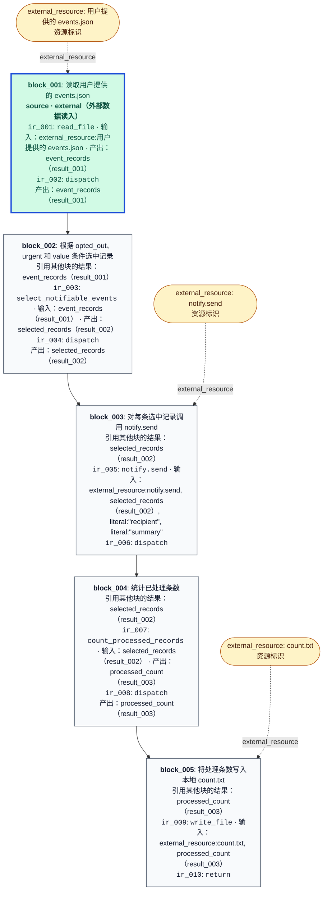

# 当前冻结 CFG：001

本图直接读取选定的 analysis.json，不增加传播层的处理段、观察或逐元素回边。



## 原始操作及限制

### ir_001

```json
{
  "id": "ir_001",
  "opcode": "read_file",
  "inputs": [
    {
      "type": "external_resource",
      "identifier": "用户提供的 events.json",
      "literal_value": null,
      "semantic_name": "用户提供的 events.json"
    }
  ],
  "outputs": [
    {
      "type": "result",
      "identifier": "result_001",
      "literal_value": null,
      "semantic_name": "event_records"
    }
  ],
  "constraints": [],
  "metadata": {},
  "draft_instruction_id": "read_events_file"
}
```

### ir_002

```json
{
  "id": "ir_002",
  "opcode": "dispatch",
  "inputs": [],
  "outputs": [],
  "constraints": [],
  "metadata": {},
  "draft_instruction_id": "go_select"
}
```

### ir_003

```json
{
  "id": "ir_003",
  "opcode": "select_notifiable_events",
  "inputs": [
    {
      "type": "result",
      "identifier": "result_001",
      "literal_value": null,
      "semantic_name": "event_records"
    }
  ],
  "outputs": [
    {
      "type": "result",
      "identifier": "result_002",
      "literal_value": null,
      "semantic_name": "selected_records"
    }
  ],
  "constraints": [
    "仅当 opted_out 不为 true，且 urgent 为 true 或 value 大于等于 100 时，选中该记录。",
    "urgent 为 true 只豁免数值门槛，不豁免 opted_out 的限制。"
  ],
  "metadata": {},
  "draft_instruction_id": "select_notifiable"
}
```

### ir_004

```json
{
  "id": "ir_004",
  "opcode": "dispatch",
  "inputs": [],
  "outputs": [],
  "constraints": [],
  "metadata": {},
  "draft_instruction_id": "go_send"
}
```

### ir_005

```json
{
  "id": "ir_005",
  "opcode": "notify.send",
  "inputs": [
    {
      "type": "external_resource",
      "identifier": "notify.send",
      "literal_value": null,
      "semantic_name": "notify.send"
    },
    {
      "type": "result",
      "identifier": "result_002",
      "literal_value": null,
      "semantic_name": "selected_records"
    },
    {
      "type": "literal",
      "identifier": null,
      "literal_value": "recipient",
      "semantic_name": null
    },
    {
      "type": "literal",
      "identifier": null,
      "literal_value": "summary",
      "semantic_name": null
    }
  ],
  "outputs": [],
  "constraints": [
    "对每条选中记录调用一次 notify.send，接收对象取该记录的 recipient 字段。",
    "notify.send 的 body 参数直接取该记录的 summary 字段原值。",
    "未选中的记录不调用 notify.send。"
  ],
  "metadata": {
    "per_record": true,
    "recipient_field": "recipient",
    "body_field": "summary"
  },
  "draft_instruction_id": "send_notify"
}
```

### ir_006

```json
{
  "id": "ir_006",
  "opcode": "dispatch",
  "inputs": [],
  "outputs": [],
  "constraints": [],
  "metadata": {},
  "draft_instruction_id": "go_count"
}
```

### ir_007

```json
{
  "id": "ir_007",
  "opcode": "count_processed_records",
  "inputs": [
    {
      "type": "result",
      "identifier": "result_002",
      "literal_value": null,
      "semantic_name": "selected_records"
    }
  ],
  "outputs": [
    {
      "type": "result",
      "identifier": "result_003",
      "literal_value": null,
      "semantic_name": "processed_count"
    }
  ],
  "constraints": [],
  "metadata": {},
  "draft_instruction_id": "count_processed_records"
}
```

### ir_008

```json
{
  "id": "ir_008",
  "opcode": "dispatch",
  "inputs": [],
  "outputs": [],
  "constraints": [],
  "metadata": {},
  "draft_instruction_id": "go_write"
}
```

### ir_009

```json
{
  "id": "ir_009",
  "opcode": "write_file",
  "inputs": [
    {
      "type": "external_resource",
      "identifier": "count.txt",
      "literal_value": null,
      "semantic_name": "count.txt"
    },
    {
      "type": "result",
      "identifier": "result_003",
      "literal_value": null,
      "semantic_name": "processed_count"
    }
  ],
  "outputs": [],
  "constraints": [
    "处理完成后，将处理条数写入本地 count.txt。"
  ],
  "metadata": {},
  "draft_instruction_id": "write_count_file"
}
```

### ir_010

```json
{
  "id": "ir_010",
  "opcode": "return",
  "inputs": [],
  "outputs": [],
  "constraints": [],
  "metadata": {},
  "draft_instruction_id": "finish"
}
```
