# 当前冻结 CFG：010

本图直接读取选定的 analysis.json，不增加传播层的处理段、观察或逐元素回边。

```mermaid
flowchart TD
  %% Auto-generated by skill-ir
  block_node_001["<b>block_001</b>: Read the user-supplied request.json<br/><b>source · external（外部数据读入）</b><br/><code>ir_001</code>: <code>read_request_json</code> · 输入：external_resource:request.json · 产出：request.json contents（result_001）<br/><code>ir_002</code>: <code>dispatch</code><br/>产出：request.json contents（result_001）"]
  block_node_002["<b>block_002</b>: Extract request.term and optional from_date and limit<br/>引用其他块的结果：request.json contents（result_001）<br/><code>ir_003</code>: <code>extract_query_term</code> · 输入：request_data（result_001） · 产出：request.term（result_002）<br/><code>ir_004</code>: <code>extract_optional_from_date</code> · 输入：request_data（result_001） · 产出：request.from_date（result_003）, whether request.from_date is present（result_004）<br/><code>ir_005</code>: <code>extract_optional_limit</code> · 输入：request_data（result_001） · 产出：request.limit（result_005）, whether request.limit is present（result_006）<br/><code>ir_006</code>: <code>dispatch</code><br/>产出：request.term（result_002）, request.from_date（result_003）, whether request.from_date is present（result_004）, request.limit（result_005）, whether request.limit is present（result_006）"]
  block_node_003["<b>block_003</b>: Call index.search once with the request term and optional arguments<br/><b>source · external（外部数据读入）</b><br/>引用其他块的结果：request.term（result_002）, request.from_date（result_003）, whether request.from_date is present（result_004）, request.limit（result_005）, whether request.limit is present（result_006）<br/><code>ir_007</code>: <code>index.search</code> · 输入：external_resource:index.search, query_term（result_002）, from_date_value（result_003）, from_date_present（result_004）, limit_value（result_005）, limit_present（result_006） · 产出：index.search response（result_007）<br/><code>ir_008</code>: <code>dispatch</code><br/>产出：index.search response（result_007）"]
  block_node_004["<b>block_004</b>: Write the response total to count.txt and return the response items<br/>引用其他块的结果：index.search response（result_007）<br/><code>ir_009</code>: <code>extract_response_total</code> · 输入：search_response（result_007） · 产出：search response total（result_008）<br/><code>ir_010</code>: <code>write_count_file</code> · 输入：external_resource:count.txt, response_total（result_008）<br/><code>ir_011</code>: <code>extract_response_items</code> · 输入：search_response（result_007） · 产出：search response items（result_009）<br/><code>ir_012</code>: <code>return</code> · 输入：response_items（result_009）<br/>产出：search response total（result_008）, search response items（result_009）"]
  resource_node_001(["external_resource: request.json<br/>资源标识"])
  resource_node_002(["external_resource: index.search<br/>资源标识"])
  resource_node_003(["external_resource: count.txt<br/>资源标识"])
  block_node_001 --> block_node_002
  block_node_002 --> block_node_003
  block_node_003 --> block_node_004
  resource_node_001 -.->|external_resource| block_node_001
  resource_node_002 -.->|external_resource| block_node_003
  resource_node_003 -.->|external_resource| block_node_004

  classDef block fill:#F8FAFC,stroke:#334155,color:#0F172A,stroke-width:1px;
  classDef source fill:#D1FAE5,stroke:#047857,color:#064E3B,stroke-width:2px;
  classDef entry stroke:#1D4ED8,stroke-width:3px;
  classDef resource fill:#FEF3C7,stroke:#B45309,color:#451A03,stroke-width:1px;
  class block_node_001,block_node_002,block_node_003,block_node_004 block;
  class block_node_001,block_node_003 source;
  class block_node_001 entry;
  class resource_node_001,resource_node_002,resource_node_003 resource;

```



## 原始操作及限制

### ir_001

```json
{
  "id": "ir_001",
  "opcode": "read_request_json",
  "inputs": [
    {
      "type": "external_resource",
      "identifier": "request.json",
      "literal_value": null,
      "semantic_name": "request.json"
    }
  ],
  "outputs": [
    {
      "type": "result",
      "identifier": "result_001",
      "literal_value": null,
      "semantic_name": "request.json contents"
    }
  ],
  "constraints": [],
  "metadata": {},
  "draft_instruction_id": "read_request_json"
}
```

### ir_002

```json
{
  "id": "ir_002",
  "opcode": "dispatch",
  "inputs": [],
  "outputs": [],
  "constraints": [],
  "metadata": {},
  "draft_instruction_id": "go_extract_params"
}
```

### ir_003

```json
{
  "id": "ir_003",
  "opcode": "extract_query_term",
  "inputs": [
    {
      "type": "result",
      "identifier": "result_001",
      "literal_value": null,
      "semantic_name": "request_data"
    }
  ],
  "outputs": [
    {
      "type": "result",
      "identifier": "result_002",
      "literal_value": null,
      "semantic_name": "request.term"
    }
  ],
  "constraints": [],
  "metadata": {},
  "draft_instruction_id": "extract_query_term"
}
```

### ir_004

```json
{
  "id": "ir_004",
  "opcode": "extract_optional_from_date",
  "inputs": [
    {
      "type": "result",
      "identifier": "result_001",
      "literal_value": null,
      "semantic_name": "request_data"
    }
  ],
  "outputs": [
    {
      "type": "result",
      "identifier": "result_003",
      "literal_value": null,
      "semantic_name": "request.from_date"
    },
    {
      "type": "result",
      "identifier": "result_004",
      "literal_value": null,
      "semantic_name": "whether request.from_date is present"
    }
  ],
  "constraints": [],
  "metadata": {},
  "draft_instruction_id": "extract_optional_from_date"
}
```

### ir_005

```json
{
  "id": "ir_005",
  "opcode": "extract_optional_limit",
  "inputs": [
    {
      "type": "result",
      "identifier": "result_001",
      "literal_value": null,
      "semantic_name": "request_data"
    }
  ],
  "outputs": [
    {
      "type": "result",
      "identifier": "result_005",
      "literal_value": null,
      "semantic_name": "request.limit"
    },
    {
      "type": "result",
      "identifier": "result_006",
      "literal_value": null,
      "semantic_name": "whether request.limit is present"
    }
  ],
  "constraints": [],
  "metadata": {},
  "draft_instruction_id": "extract_optional_limit"
}
```

### ir_006

```json
{
  "id": "ir_006",
  "opcode": "dispatch",
  "inputs": [],
  "outputs": [],
  "constraints": [],
  "metadata": {},
  "draft_instruction_id": "go_search"
}
```

### ir_007

```json
{
  "id": "ir_007",
  "opcode": "index.search",
  "inputs": [
    {
      "type": "external_resource",
      "identifier": "index.search",
      "literal_value": null,
      "semantic_name": "index.search"
    },
    {
      "type": "result",
      "identifier": "result_002",
      "literal_value": null,
      "semantic_name": "query_term"
    },
    {
      "type": "result",
      "identifier": "result_003",
      "literal_value": null,
      "semantic_name": "from_date_value"
    },
    {
      "type": "result",
      "identifier": "result_004",
      "literal_value": null,
      "semantic_name": "from_date_present"
    },
    {
      "type": "result",
      "identifier": "result_005",
      "literal_value": null,
      "semantic_name": "limit_value"
    },
    {
      "type": "result",
      "identifier": "result_006",
      "literal_value": null,
      "semantic_name": "limit_present"
    }
  ],
  "outputs": [
    {
      "type": "result",
      "identifier": "result_007",
      "literal_value": null,
      "semantic_name": "index.search response"
    }
  ],
  "constraints": [
    "Use request.term unchanged as its query argument.",
    "When from_date is present, pass its value unchanged; the accepted format is YYYY-MM-DD.",
    "When from_date is missing, omit the from_date argument.",
    "When limit is present, pass its value unchanged as the limit argument.",
    "When limit is missing, omit the limit argument.",
    "Apply the missing-argument settings in query configuration to this same call: missing_arguments.from_date = omit, missing_arguments.limit = omit."
  ],
  "metadata": {},
  "draft_instruction_id": "call_index_search"
}
```

### ir_008

```json
{
  "id": "ir_008",
  "opcode": "dispatch",
  "inputs": [],
  "outputs": [],
  "constraints": [],
  "metadata": {},
  "draft_instruction_id": "go_post_search"
}
```

### ir_009

```json
{
  "id": "ir_009",
  "opcode": "extract_response_total",
  "inputs": [
    {
      "type": "result",
      "identifier": "result_007",
      "literal_value": null,
      "semantic_name": "search_response"
    }
  ],
  "outputs": [
    {
      "type": "result",
      "identifier": "result_008",
      "literal_value": null,
      "semantic_name": "search response total"
    }
  ],
  "constraints": [],
  "metadata": {},
  "draft_instruction_id": "extract_response_total"
}
```

### ir_010

```json
{
  "id": "ir_010",
  "opcode": "write_count_file",
  "inputs": [
    {
      "type": "external_resource",
      "identifier": "count.txt",
      "literal_value": null,
      "semantic_name": "count.txt"
    },
    {
      "type": "result",
      "identifier": "result_008",
      "literal_value": null,
      "semantic_name": "response_total"
    }
  ],
  "outputs": [],
  "constraints": [
    "After the search, write the response's total value to local count.txt."
  ],
  "metadata": {},
  "draft_instruction_id": "write_count_file"
}
```

### ir_011

```json
{
  "id": "ir_011",
  "opcode": "extract_response_items",
  "inputs": [
    {
      "type": "result",
      "identifier": "result_007",
      "literal_value": null,
      "semantic_name": "search_response"
    }
  ],
  "outputs": [
    {
      "type": "result",
      "identifier": "result_009",
      "literal_value": null,
      "semantic_name": "search response items"
    }
  ],
  "constraints": [],
  "metadata": {},
  "draft_instruction_id": "extract_response_items"
}
```

### ir_012

```json
{
  "id": "ir_012",
  "opcode": "return",
  "inputs": [
    {
      "type": "result",
      "identifier": "result_009",
      "literal_value": null,
      "semantic_name": "response_items"
    }
  ],
  "outputs": [],
  "constraints": [
    "Return the search response's items value unchanged."
  ],
  "metadata": {},
  "draft_instruction_id": "return_items"
}
```
