# 当前冻结 CFG：013

本图直接读取选定的 analysis.json，不增加传播层的处理段、观察或逐元素回边。

```mermaid
flowchart TD
  %% Auto-generated by skill-ir
  block_node_001["<b>block_001</b>: Read source_id from the user's request<br/><b>source · context（上下文读入）</b><br/><code>ir_001</code>: <code>read_source_id_from_user_request</code> · 读取上下文：context_key:user_request · 产出：source_id（result_001）<br/><code>ir_002</code>: <code>dispatch</code><br/>产出：source_id（result_001）"]
  block_node_002["<b>block_002</b>: Read FAST_KEY from the environment<br/><b>source · context（上下文读入）</b><br/><code>ir_003</code>: <code>read_fast_key_from_environment</code> · 读取上下文：context_key:environment · 产出：fast_key（result_002）<br/><code>ir_004</code>: <code>dispatch</code><br/>产出：fast_key（result_002）"]
  block_node_003["<b>block_003</b>: Check whether FAST_KEY is present<br/>引用其他块的结果：fast_key（result_002）<br/><code>ir_005</code>: <code>check_fast_key_presence</code> · 输入：fast_key（result_002） · 产出：fast_key_present（result_003）<br/><code>ir_006</code>: <code>dispatch</code> · 输入：fast_key_present（result_003）<br/>产出：fast_key_present（result_003）"]
  block_node_004["<b>block_004</b>: Try fast.fetch first with source_id and FAST_KEY<br/><b>source · external（外部数据读入）</b><br/>引用其他块的结果：source_id（result_001）, fast_key（result_002）<br/><code>ir_007</code>: <code>fast.fetch</code> · 输入：external_resource:fast.fetch, source_id（result_001）, fast_key（result_002） · 产出：fast_fetch_first_response（result_004）<br/><code>ir_008</code>: <code>dispatch</code><br/>产出：fast_fetch_first_response（result_004）"]
  block_node_005["<b>block_005</b>: Classify the first fast.fetch attempt<br/>引用其他块的结果：fast_fetch_first_response（result_004）<br/><code>ir_009</code>: <code>classify_fast_fetch_outcome</code> · 输入：fast_fetch_first_response（result_004） · 产出：fast_fetch_first_outcome（result_005）, fast_fetch_first_body（result_006）<br/><code>ir_010</code>: <code>dispatch</code> · 输入：fast_fetch_first_outcome（result_005）<br/>产出：fast_fetch_first_outcome（result_005）, fast_fetch_first_body（result_006）"]
  block_node_006["<b>block_006</b>: Retry fast.fetch once with source_id and FAST_KEY<br/><b>source · external（外部数据读入）</b><br/>引用其他块的结果：source_id（result_001）, fast_key（result_002）<br/><code>ir_011</code>: <code>fast.fetch</code> · 输入：external_resource:fast.fetch, source_id（result_001）, fast_key（result_002） · 产出：fast_fetch_retry_response（result_007）<br/><code>ir_012</code>: <code>dispatch</code><br/>产出：fast_fetch_retry_response（result_007）"]
  block_node_007["<b>block_007</b>: Classify the fast.fetch retry<br/>引用其他块的结果：fast_fetch_retry_response（result_007）<br/><code>ir_013</code>: <code>classify_fast_fetch_outcome</code> · 输入：fast_fetch_retry_response（result_007） · 产出：fast_fetch_retry_outcome（result_008）, fast_fetch_retry_body（result_009）<br/><code>ir_014</code>: <code>dispatch</code> · 输入：fast_fetch_retry_outcome（result_008）<br/>产出：fast_fetch_retry_outcome（result_008）, fast_fetch_retry_body（result_009）"]
  block_node_008["<b>block_008</b>: Call archive.fetch with source_id only<br/><b>source · external（外部数据读入）</b><br/>引用其他块的结果：source_id（result_001）<br/><code>ir_015</code>: <code>archive.fetch</code> · 输入：external_resource:archive.fetch, source_id（result_001） · 产出：archive_fetch_response（result_010）<br/><code>ir_016</code>: <code>dispatch</code><br/>产出：archive_fetch_response（result_010）"]
  block_node_009["<b>block_009</b>: Classify the archive.fetch result<br/>引用其他块的结果：archive_fetch_response（result_010）<br/><code>ir_017</code>: <code>classify_fetch_outcome</code> · 输入：archive_fetch_response（result_010） · 产出：archive_fetch_outcome（result_011）, archive_fetch_body（result_012）, archive_fetch_error（result_013）<br/><code>ir_018</code>: <code>dispatch</code> · 输入：archive_fetch_outcome（result_011）<br/>产出：archive_fetch_outcome（result_011）, archive_fetch_body（result_012）, archive_fetch_error（result_013）"]
  block_node_010["<b>block_010</b>: Append status and return the first fast.fetch body<br/>引用其他块的结果：fast_fetch_first_outcome（result_005）, fast_fetch_first_body（result_006）<br/><code>ir_019</code>: <code>append_final_status_to_local_status_file</code> · 输入：external_resource:status.txt, fast_fetch_first_outcome（result_005）<br/><code>ir_020</code>: <code>return</code> · 输入：fast_fetch_first_body（result_006）"]
  block_node_011["<b>block_011</b>: Append status and return the fast.fetch retry body<br/>引用其他块的结果：fast_fetch_retry_outcome（result_008）, fast_fetch_retry_body（result_009）<br/><code>ir_021</code>: <code>append_final_status_to_local_status_file</code> · 输入：external_resource:status.txt, fast_fetch_retry_outcome（result_008）<br/><code>ir_022</code>: <code>return</code> · 输入：fast_fetch_retry_body（result_009）"]
  block_node_012["<b>block_012</b>: Append status and return the archive.fetch body<br/>引用其他块的结果：archive_fetch_outcome（result_011）, archive_fetch_body（result_012）<br/><code>ir_023</code>: <code>append_final_status_to_local_status_file</code> · 输入：external_resource:status.txt, archive_fetch_outcome（result_011）<br/><code>ir_024</code>: <code>return</code> · 输入：archive_fetch_body（result_012）"]
  block_node_013["<b>block_013</b>: Append status and return the archive.fetch error<br/>引用其他块的结果：archive_fetch_outcome（result_011）, archive_fetch_error（result_013）<br/><code>ir_025</code>: <code>append_final_status_to_local_status_file</code> · 输入：external_resource:status.txt, archive_fetch_outcome（result_011）<br/><code>ir_026</code>: <code>return</code> · 输入：archive_fetch_error（result_013）"]
  resource_node_001(["external_resource: fast.fetch<br/>资源标识"])
  resource_node_002(["external_resource: archive.fetch<br/>资源标识"])
  resource_node_003(["external_resource: status.txt<br/>资源标识"])
  block_node_001 --> block_node_002
  block_node_002 --> block_node_003
  block_node_003 -->|FAST_KEY present| block_node_004
  block_node_003 -->|FAST_KEY absent| block_node_008
  block_node_004 --> block_node_005
  block_node_005 -->|first fast.fetch attempt succeeds| block_node_010
  block_node_005 -->|first fast.fetch attempt fails with a transient error| block_node_006
  block_node_005 -->|first fast.fetch attempt fails with a non-transient error| block_node_008
  block_node_006 --> block_node_007
  block_node_007 -->|fast.fetch retry succeeds| block_node_011
  block_node_007 -->|fast.fetch retry fails| block_node_008
  block_node_008 --> block_node_009
  block_node_009 -->|archive.fetch succeeds| block_node_012
  block_node_009 -->|archive.fetch fails| block_node_013
  resource_node_001 -.->|external_resource| block_node_004
  resource_node_001 -.->|external_resource| block_node_006
  resource_node_002 -.->|external_resource| block_node_008
  resource_node_003 -.->|external_resource| block_node_010
  resource_node_003 -.->|external_resource| block_node_011
  resource_node_003 -.->|external_resource| block_node_012
  resource_node_003 -.->|external_resource| block_node_013

  classDef block fill:#F8FAFC,stroke:#334155,color:#0F172A,stroke-width:1px;
  classDef source fill:#D1FAE5,stroke:#047857,color:#064E3B,stroke-width:2px;
  classDef entry stroke:#1D4ED8,stroke-width:3px;
  classDef resource fill:#FEF3C7,stroke:#B45309,color:#451A03,stroke-width:1px;
  class block_node_001,block_node_002,block_node_003,block_node_004,block_node_005,block_node_006,block_node_007,block_node_008,block_node_009,block_node_010,block_node_011,block_node_012,block_node_013 block;
  class block_node_001,block_node_002,block_node_004,block_node_006,block_node_008 source;
  class block_node_001 entry;
  class resource_node_001,resource_node_002,resource_node_003 resource;

```



## 原始操作及限制

### ir_001

```json
{
  "id": "ir_001",
  "opcode": "read_source_id_from_user_request",
  "inputs": [
    {
      "type": "context_key",
      "identifier": "user_request",
      "literal_value": null,
      "semantic_name": "user_request"
    }
  ],
  "outputs": [
    {
      "type": "result",
      "identifier": "result_001",
      "literal_value": null,
      "semantic_name": "source_id"
    }
  ],
  "constraints": [],
  "metadata": {},
  "draft_instruction_id": "read_source_id_instruction"
}
```

### ir_002

```json
{
  "id": "ir_002",
  "opcode": "dispatch",
  "inputs": [],
  "outputs": [],
  "constraints": [],
  "metadata": {},
  "draft_instruction_id": "go_read_fast_key"
}
```

### ir_003

```json
{
  "id": "ir_003",
  "opcode": "read_fast_key_from_environment",
  "inputs": [
    {
      "type": "context_key",
      "identifier": "environment",
      "literal_value": null,
      "semantic_name": "environment"
    }
  ],
  "outputs": [
    {
      "type": "result",
      "identifier": "result_002",
      "literal_value": null,
      "semantic_name": "fast_key"
    }
  ],
  "constraints": [],
  "metadata": {},
  "draft_instruction_id": "read_fast_key_instruction"
}
```

### ir_004

```json
{
  "id": "ir_004",
  "opcode": "dispatch",
  "inputs": [],
  "outputs": [],
  "constraints": [],
  "metadata": {},
  "draft_instruction_id": "go_decide_fast_key"
}
```

### ir_005

```json
{
  "id": "ir_005",
  "opcode": "check_fast_key_presence",
  "inputs": [
    {
      "type": "result",
      "identifier": "result_002",
      "literal_value": null,
      "semantic_name": "fast_key"
    }
  ],
  "outputs": [
    {
      "type": "result",
      "identifier": "result_003",
      "literal_value": null,
      "semantic_name": "fast_key_present"
    }
  ],
  "constraints": [],
  "metadata": {},
  "draft_instruction_id": "check_fast_key_presence_instruction"
}
```

### ir_006

```json
{
  "id": "ir_006",
  "opcode": "dispatch",
  "inputs": [
    {
      "type": "result",
      "identifier": "result_003",
      "literal_value": null,
      "semantic_name": "fast_key_present"
    }
  ],
  "outputs": [],
  "constraints": [],
  "metadata": {},
  "draft_instruction_id": "choose_fetch_path"
}
```

### ir_007

```json
{
  "id": "ir_007",
  "opcode": "fast.fetch",
  "inputs": [
    {
      "type": "external_resource",
      "identifier": "fast.fetch",
      "literal_value": null,
      "semantic_name": "fast.fetch"
    },
    {
      "type": "result",
      "identifier": "result_001",
      "literal_value": null,
      "semantic_name": "source_id"
    },
    {
      "type": "result",
      "identifier": "result_002",
      "literal_value": null,
      "semantic_name": "fast_key"
    }
  ],
  "outputs": [
    {
      "type": "result",
      "identifier": "result_004",
      "literal_value": null,
      "semantic_name": "fast_fetch_first_response"
    }
  ],
  "constraints": [],
  "metadata": {},
  "draft_instruction_id": "call_fast_fetch_first"
}
```

### ir_008

```json
{
  "id": "ir_008",
  "opcode": "dispatch",
  "inputs": [],
  "outputs": [],
  "constraints": [],
  "metadata": {},
  "draft_instruction_id": "go_check_fast_fetch_first"
}
```

### ir_009

```json
{
  "id": "ir_009",
  "opcode": "classify_fast_fetch_outcome",
  "inputs": [
    {
      "type": "result",
      "identifier": "result_004",
      "literal_value": null,
      "semantic_name": "fast_fetch_first_response"
    }
  ],
  "outputs": [
    {
      "type": "result",
      "identifier": "result_005",
      "literal_value": null,
      "semantic_name": "fast_fetch_first_outcome"
    },
    {
      "type": "result",
      "identifier": "result_006",
      "literal_value": null,
      "semantic_name": "fast_fetch_first_body"
    }
  ],
  "constraints": [],
  "metadata": {},
  "draft_instruction_id": "classify_fast_fetch_first_instruction"
}
```

### ir_010

```json
{
  "id": "ir_010",
  "opcode": "dispatch",
  "inputs": [
    {
      "type": "result",
      "identifier": "result_005",
      "literal_value": null,
      "semantic_name": "fast_fetch_first_outcome"
    }
  ],
  "outputs": [],
  "constraints": [],
  "metadata": {},
  "draft_instruction_id": "choose_fast_fetch_first_outcome"
}
```

### ir_011

```json
{
  "id": "ir_011",
  "opcode": "fast.fetch",
  "inputs": [
    {
      "type": "external_resource",
      "identifier": "fast.fetch",
      "literal_value": null,
      "semantic_name": "fast.fetch"
    },
    {
      "type": "result",
      "identifier": "result_001",
      "literal_value": null,
      "semantic_name": "source_id"
    },
    {
      "type": "result",
      "identifier": "result_002",
      "literal_value": null,
      "semantic_name": "fast_key"
    }
  ],
  "outputs": [
    {
      "type": "result",
      "identifier": "result_007",
      "literal_value": null,
      "semantic_name": "fast_fetch_retry_response"
    }
  ],
  "constraints": [
    "Retry fast.fetch exactly once only when its first attempt fails with a transient error; do not retry a non-transient first failure."
  ],
  "metadata": {},
  "draft_instruction_id": "call_fast_fetch_retry"
}
```

### ir_012

```json
{
  "id": "ir_012",
  "opcode": "dispatch",
  "inputs": [],
  "outputs": [],
  "constraints": [],
  "metadata": {},
  "draft_instruction_id": "go_check_fast_fetch_retry"
}
```

### ir_013

```json
{
  "id": "ir_013",
  "opcode": "classify_fast_fetch_outcome",
  "inputs": [
    {
      "type": "result",
      "identifier": "result_007",
      "literal_value": null,
      "semantic_name": "fast_fetch_retry_response"
    }
  ],
  "outputs": [
    {
      "type": "result",
      "identifier": "result_008",
      "literal_value": null,
      "semantic_name": "fast_fetch_retry_outcome"
    },
    {
      "type": "result",
      "identifier": "result_009",
      "literal_value": null,
      "semantic_name": "fast_fetch_retry_body"
    }
  ],
  "constraints": [],
  "metadata": {},
  "draft_instruction_id": "classify_fast_fetch_retry_instruction"
}
```

### ir_014

```json
{
  "id": "ir_014",
  "opcode": "dispatch",
  "inputs": [
    {
      "type": "result",
      "identifier": "result_008",
      "literal_value": null,
      "semantic_name": "fast_fetch_retry_outcome"
    }
  ],
  "outputs": [],
  "constraints": [],
  "metadata": {},
  "draft_instruction_id": "choose_fast_fetch_retry_outcome"
}
```

### ir_015

```json
{
  "id": "ir_015",
  "opcode": "archive.fetch",
  "inputs": [
    {
      "type": "external_resource",
      "identifier": "archive.fetch",
      "literal_value": null,
      "semantic_name": "archive.fetch"
    },
    {
      "type": "result",
      "identifier": "result_001",
      "literal_value": null,
      "semantic_name": "source_id"
    }
  ],
  "outputs": [
    {
      "type": "result",
      "identifier": "result_010",
      "literal_value": null,
      "semantic_name": "archive_fetch_response"
    }
  ],
  "constraints": [
    "Call archive.fetch at most once and pass source_id as its only argument.",
    "Never pass FAST_KEY to archive.fetch or diagnostic output anywhere in this workflow."
  ],
  "metadata": {},
  "draft_instruction_id": "call_archive_fetch"
}
```

### ir_016

```json
{
  "id": "ir_016",
  "opcode": "dispatch",
  "inputs": [],
  "outputs": [],
  "constraints": [],
  "metadata": {},
  "draft_instruction_id": "go_check_archive_fetch"
}
```

### ir_017

```json
{
  "id": "ir_017",
  "opcode": "classify_fetch_outcome",
  "inputs": [
    {
      "type": "result",
      "identifier": "result_010",
      "literal_value": null,
      "semantic_name": "archive_fetch_response"
    }
  ],
  "outputs": [
    {
      "type": "result",
      "identifier": "result_011",
      "literal_value": null,
      "semantic_name": "archive_fetch_outcome"
    },
    {
      "type": "result",
      "identifier": "result_012",
      "literal_value": null,
      "semantic_name": "archive_fetch_body"
    },
    {
      "type": "result",
      "identifier": "result_013",
      "literal_value": null,
      "semantic_name": "archive_fetch_error"
    }
  ],
  "constraints": [],
  "metadata": {},
  "draft_instruction_id": "classify_archive_fetch_instruction"
}
```

### ir_018

```json
{
  "id": "ir_018",
  "opcode": "dispatch",
  "inputs": [
    {
      "type": "result",
      "identifier": "result_011",
      "literal_value": null,
      "semantic_name": "archive_fetch_outcome"
    }
  ],
  "outputs": [],
  "constraints": [],
  "metadata": {},
  "draft_instruction_id": "choose_archive_fetch_outcome"
}
```

### ir_019

```json
{
  "id": "ir_019",
  "opcode": "append_final_status_to_local_status_file",
  "inputs": [
    {
      "type": "external_resource",
      "identifier": "status.txt",
      "literal_value": null,
      "semantic_name": "status.txt"
    },
    {
      "type": "result",
      "identifier": "result_005",
      "literal_value": null,
      "semantic_name": "fast_fetch_first_outcome"
    }
  ],
  "outputs": [],
  "constraints": [
    "Before returning from every success or failure path, append the final status to local status.txt."
  ],
  "metadata": {},
  "draft_instruction_id": "append_fast_fetch_first_status"
}
```

### ir_020

```json
{
  "id": "ir_020",
  "opcode": "return",
  "inputs": [
    {
      "type": "result",
      "identifier": "result_006",
      "literal_value": null,
      "semantic_name": "fast_fetch_first_body"
    }
  ],
  "outputs": [],
  "constraints": [],
  "metadata": {},
  "draft_instruction_id": "return_fast_fetch_first_body_instruction"
}
```

### ir_021

```json
{
  "id": "ir_021",
  "opcode": "append_final_status_to_local_status_file",
  "inputs": [
    {
      "type": "external_resource",
      "identifier": "status.txt",
      "literal_value": null,
      "semantic_name": "status.txt"
    },
    {
      "type": "result",
      "identifier": "result_008",
      "literal_value": null,
      "semantic_name": "fast_fetch_retry_outcome"
    }
  ],
  "outputs": [],
  "constraints": [
    "Before returning from every success or failure path, append the final status to local status.txt."
  ],
  "metadata": {},
  "draft_instruction_id": "append_fast_fetch_retry_status"
}
```

### ir_022

```json
{
  "id": "ir_022",
  "opcode": "return",
  "inputs": [
    {
      "type": "result",
      "identifier": "result_009",
      "literal_value": null,
      "semantic_name": "fast_fetch_retry_body"
    }
  ],
  "outputs": [],
  "constraints": [],
  "metadata": {},
  "draft_instruction_id": "return_fast_fetch_retry_body_instruction"
}
```

### ir_023

```json
{
  "id": "ir_023",
  "opcode": "append_final_status_to_local_status_file",
  "inputs": [
    {
      "type": "external_resource",
      "identifier": "status.txt",
      "literal_value": null,
      "semantic_name": "status.txt"
    },
    {
      "type": "result",
      "identifier": "result_011",
      "literal_value": null,
      "semantic_name": "archive_fetch_outcome"
    }
  ],
  "outputs": [],
  "constraints": [
    "Before returning from every success or failure path, append the final status to local status.txt."
  ],
  "metadata": {},
  "draft_instruction_id": "append_archive_fetch_success_status"
}
```

### ir_024

```json
{
  "id": "ir_024",
  "opcode": "return",
  "inputs": [
    {
      "type": "result",
      "identifier": "result_012",
      "literal_value": null,
      "semantic_name": "archive_fetch_body"
    }
  ],
  "outputs": [],
  "constraints": [],
  "metadata": {},
  "draft_instruction_id": "return_archive_fetch_success_body"
}
```

### ir_025

```json
{
  "id": "ir_025",
  "opcode": "append_final_status_to_local_status_file",
  "inputs": [
    {
      "type": "external_resource",
      "identifier": "status.txt",
      "literal_value": null,
      "semantic_name": "status.txt"
    },
    {
      "type": "result",
      "identifier": "result_011",
      "literal_value": null,
      "semantic_name": "archive_fetch_outcome"
    }
  ],
  "outputs": [],
  "constraints": [
    "Before returning from every success or failure path, append the final status to local status.txt."
  ],
  "metadata": {},
  "draft_instruction_id": "append_archive_fetch_failure_status"
}
```

### ir_026

```json
{
  "id": "ir_026",
  "opcode": "return",
  "inputs": [
    {
      "type": "result",
      "identifier": "result_013",
      "literal_value": null,
      "semantic_name": "archive_fetch_error"
    }
  ],
  "outputs": [],
  "constraints": [],
  "metadata": {},
  "draft_instruction_id": "return_archive_fetch_failure_error"
}
```
